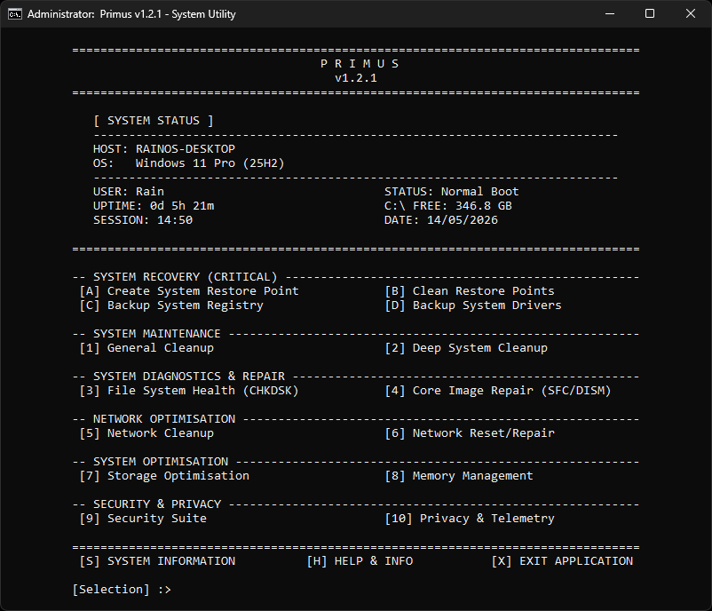

# 🛠️ Primus - System Utility

[](LICENSE)
[](https://www.microsoft.com/windows)
[](https://github.com/R4in84/Primus/releases)
[](https://en.wikipedia.org/wiki/Batch_file)

> Primus is a A command-line system maintenance utility for Windows 10/11 designed to consolidate common system maintenance, cleanup, and repair tasks into a single, easy-to-use interface with intelligent safety protocols and comprehensive logging.

> It utilizes native Windows tools (such as SFC, DISM, and PowerShell WMI) to help maintain system health and resolve common operating system or network issues.



---

## ⚡ Features

### **System Recovery**
- ✅ Create manual System Restore Points with VSS
- ✅ Intelligent Shadow Copy cleanup (keeps most recent)
- ✅ Automatic disk space validation before operations

### **System Maintenance**
- ✅ Deep cleanup of temporary files (User + System)
- ✅ Prefetch cache optimization
- ✅ Windows Update download cache reset
- ✅ Thumbnail database regeneration
- ✅ Recycle Bin purge (all drives)
- ✅ Native Disk Cleanup integration
- ✅ Icon cache rebuild (fixes broken icons)
- ✅ **Multi-browser cache purge** (Chrome, Edge, Firefox, Brave, Opera, Arc, Vivaldi, LibreWolf, Waterfox)
- ✅ Windows Store cache reset
- ✅ WinSxS Component Store cleanup (Standard + Deep modes)
- ✅ Crash dump and error report cleanup
- ✅ Event log clearing

### **Network Optimization**
- ✅ DNS cache display/flush
- ✅ ARP cache display/clear
- ✅ IP address release/renew
- ✅ TCP/IP stack reset
- ✅ Winsock catalog reset

### **System Repair**
- ✅ System File Checker (SFC) with intelligent log parsing
- ✅ DISM Image Health Check (Quick)
- ✅ DISM Deep Image Scan
- ✅ DISM Restore Health (automatic repair)

---

## 🛡️ Safety Features

| Feature | Description |
|---------|-------------|
| **Admin Enforcement** | Automatic UAC elevation request if not running as admin |
| **First-Run EULA** | Mandatory acknowledgment of risks on initial launch |
| **Disk Space Validation** | Prevents operations when <2GB free to avoid corruption |
| **User Confirmations** | All destructive operations require Y/N confirmation |
| **Locked File Protection** | Automatically skips in-use files (no forced deletions) |
| **Session Logging** | Every action is logged with timestamp and categorization |
| **Safe Mode Detection** | Displays boot status in header for awareness |
| **LTSC/Server Guards** | Warns when attempting incompatible operations |

---

## 💻 System Requirements

| Requirement | Specification |
|-------------|---------------|
| **Operating System** | Windows 10 (Build 19041+) or Windows 11 |
| **Privileges** | Administrator rights required |
| **PowerShell** | Version 5.1 or higher (pre-installed on modern Windows) |
| **Disk Space** | Minimum 2GB free for repair operations |
| **Architecture** | x64 or ARM64 (tested on x64) |

---

## 📥 Installation

### **Option 1: Direct Download**
1. Go to the [Releases](https://github.com/R4in84/Primus/releases) page
2. Download `Primus.bat` from the latest release
3. Save to a permanent location (e.g., `C:\Tools\Primus\`)

### **Option 2: Git Clone**
```bash
git clone https://github.com/R4in84/Primus.git
cd Primus
